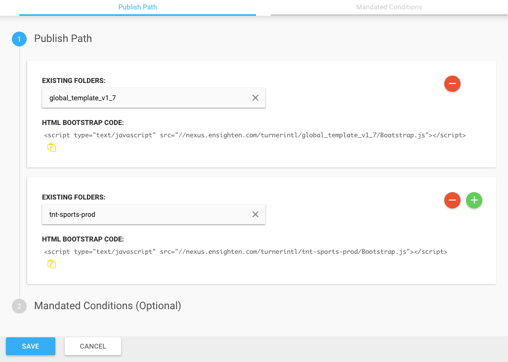

# 3. Add To Global Template

Add the newly created Space to the latest global template.

1. Click **Spaces** from left menu.
2. Edit the latest global template Space.
3. Add your space.
4. Save changes.

