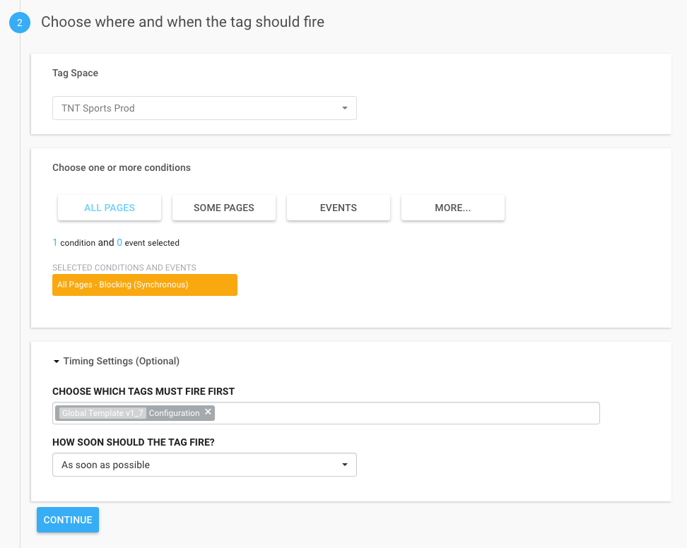

# 4. Create Site Configuration Tag

1. Create a new Custom JavaScript called **"Site Configuration"** \(Do not merge from other Configuration tag. If you do, it will inherit the settings and you will not be able to perform the next steps.\).
2. Copy the **Configuration** code from the global template and add to the **Site Configuration** tag.
3. Update the configuration to appropriate values.
4. Choose **Synchronous** condition.
5. Choose the **Configuration** code from the global template to fire first.
6. Save changes.



**Example Site Configuration Tag**

```text
window.tdi = window.tdi || {};
window.tdi.util = window.tdi.util || {};

window.tdi.global_template_version = typeof window.tdi.global_template_version === 'string' ? window.tdi.global_template_version : "gt1.9.6";

/* Space Configuration Parameters */
window.tdi.configuration = {
  'oneTrust': {
    'useUserConsent': false
  },
  'adobeAnalytics': {
    'adobeObj': 'tdi_s',
    'rsidPROD': 'turnerintglobal',
    'rsidDEV': 'turnerintglobaldev',
    'trackingServer': 'turnerinternational.sc.omtrdc.net',
    'trackingServerSecure': 'turnerinternational.sc.omtrdc.net',
    'visitorNamespace': 'turnerinternational',
    'cookieDomainPeriods': /\w+\.(com|co|tv)\.\w+$/.test(location.hostname) ? "3" : "2",
    'trackDownloadLinks': true,
    'trackExternalLinks': true,
    'trackInlineStats': true,
    'linkDownloadFileTypes': 'exe,zip,wav,mp3,mov,mpg,avi,wmv,pdf,doc,docx,xls,xlsx,ppt,pptx',
    'linkInternalFilters': 'javascript:,dmti.cloud,example.net',
    'expCldID': '7FF852E2556756057F000101@AdobeOrg',
    'charSet': 'UTF-8',
    'isProd': (function(d) {
      return typeof d === 'object' && typeof d.publishPath === 'string' && d.publishPath.toLowerCase().indexOf('prod') > -1 ? true : false;
    })(ensightenOptions)
  },
  'media': {
    'trackingServer': 'turnerinternational.hb.omtrdc.net',
    'debugLogging': false,
    'ssl': true,
    'playerName': 'intl',
    'channel': 'intl web',
    'appVersion': 'intl',
    'ovp': 'intl'
  },
  'ensighten': {
    'spaceLastPublished': tdi.global_template_version + " - " + Bootstrapper.ensightenOptions.publishPath + " - " + Bootstrapper.ensightenOptions.generatedOn
  }
};
```

#### 

