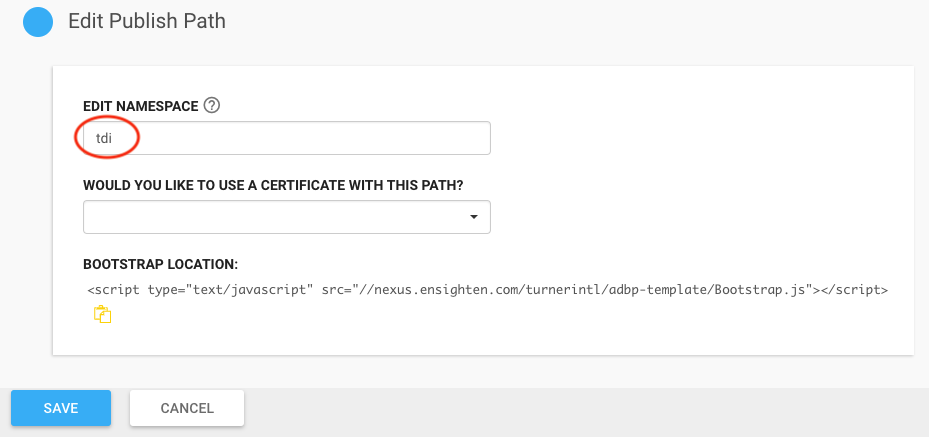

# 2. Update Namespace

Update the Namespace of the newly created Space, so it does not conflict with another Bootstrap on a page.

1. Log in to Ensighten Manage.
2. Click **Publish Paths** from left menu.
3. Edit the Publish Path of the newly created Space.
4. Change the Namespace from "Bootstrapper" to "tdi".
5. Save changes.

